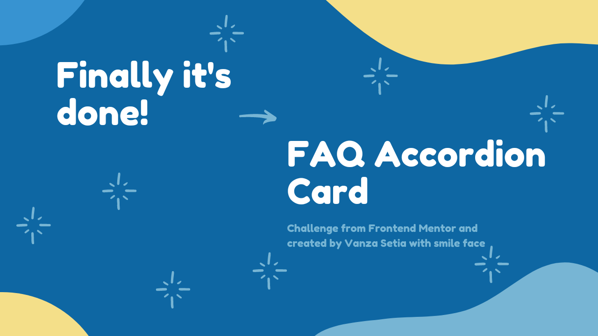
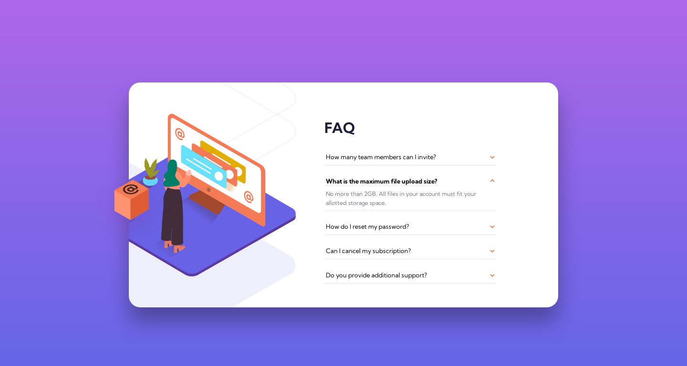

<!-- Banner -->

<!-- ENDOF Banner-->

<!-- Badges -->

  
  
  
  
  
  

<!-- ENDOF Badges -->

<!-- Other Badges -->

  
    

<!-- ENDOF Other Badges -->

<!-- Title -->
# 
<!-- Title -->

<!-- Table Of Contents -->
## Table of contents
- [Overview](#overview)
  - [Introduction](#introduction)
  - [The challenge](#the-challenge)
  - [Links](#links)
  - [Screenshots](#screenshots)
- [My process](#my-process)
  - [Built with](#built-with)
  - [What I learned](#what-i-learned)
  - [Useful resources](#useful-resources)
- [How to contribute](#how-to-contribute)
- [Author](#author)
- [Acknowledgements](#acknowledgements)
- [License](#license)
- [References](#references)
<!-- ENDOF Table Of Contents -->

<!-- Overview -->
## Overview
[(Back to top)](#table-of-contents)

### Introduction

### The Challenge

### Links
- [🌐 Live Review](https://vanzafaqaccordioncard.netlify.app/)
- [👨‍🏫 Frontend Mentor Solution]()
- [📖 My Walkthrough]()

### Screenshots

Desktop

Mobile

<!-- ENDOF Overview -->

<!-- My Process -->
## My Process
[(Back to top)](#table-of-contents)

### Built With
- HTML Semantic Tags
- [Sass](https://sass-lang.com/)
- Vanilla JavaScript
- Flexbox
- Mobile-first workflow
- [Normalize.css](https://necolas.github.io/normalize.css/)
- [Eruda - mobile console browser](https://github.com/liriliri/eruda)

### What I Learned

### Useful Resources

<!-- ENDOF My Process -->

<!-- How To Contribute -->
## How To Contribute?
[(Back to top)](#table-of-contents)

Just [follow the steps](https://github.com/vanzasetia/faq-accordion-card/blob/master/CONTRIBUTING.md) and you are good to go.

**Happy Contributing!**
<!-- ENDOF How To Contribute -->

## Author
[(Back to top)](#table-of-contents)

- Frontend Mentor - [@vanzasetia](https://www.frontendmentor.io/profile/vanzasetia)
- Twitter - [@vanzasetia](https://www.twitter.com/vanzasetia)
- Code Newbie - [@vanzasetia](https://community.codenewbie.org/vanzasetia)
- Want to see me on other platform? [Check my linktree!](https://linktr.ee/vanzasetia)
<!-- ENDOF Author -->

<!-- Acknowledgements -->
## Acknowledgements
[(Back to top)](#table-of-contents)
<!-- END OF Acknowledgements -->

<!-- LICENSE -->
## License
[(Back to top)](#table-of-contents)

>You can check out [the full license](https://github.com/vanzasetia/faq-accordion-card/blob/master/LICENSE)

This project is licensed under the terms of the MIT license.

For those of you who are wondering, why do I need to license this? 
- Well, first it's free 😁.
- Second I checked this [Choose license website](https://choosealicense.com/) to help me chose a license.
- The last reason, if I don't want to choose a license, then [here's what gonna happen](https://choosealicense.com/no-permission/).
<!-- ENDOF LICENSE -->

<!-- References -->
## References

[(Back to top)](#table-of-contents)

> See the [documentation.](https://github.com/vanzasetia/faq-accordion-card/blob/master/docs/README.md)
<!-- ENDOF References -->